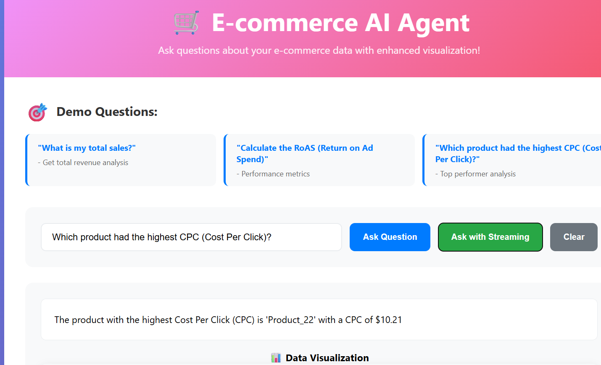
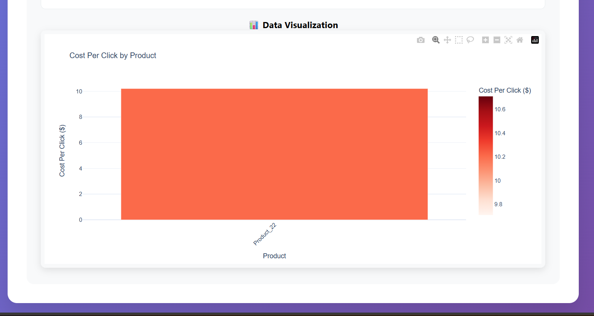
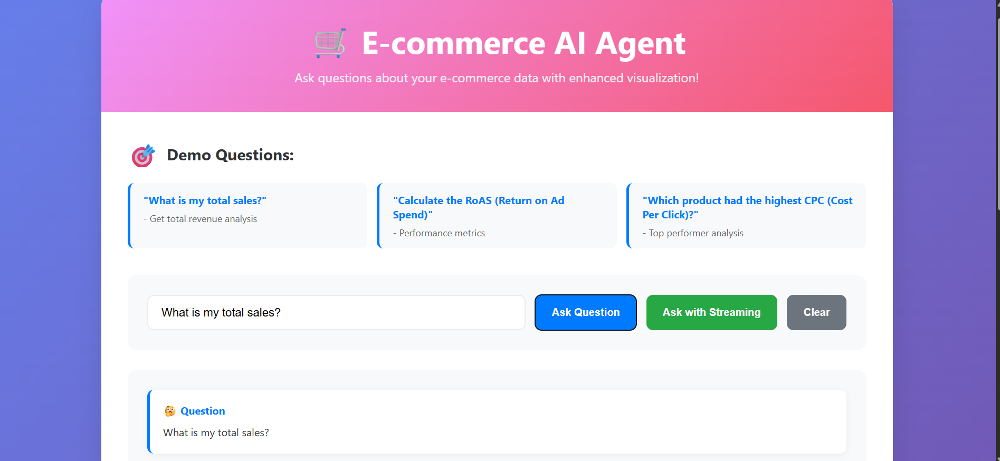
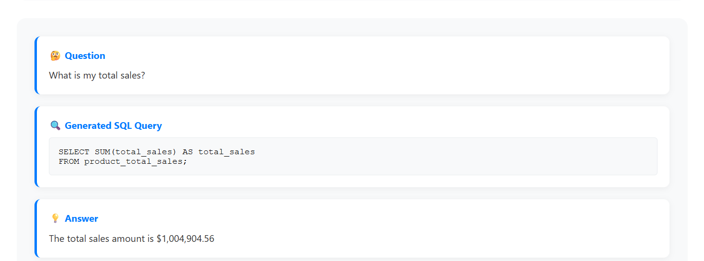

# 🛒 E-commerce AI Agent with Gemini 2.5 Integration

An advanced AI-powered agent that transforms natural language questions into SQL queries and provides comprehensive e-commerce insights with beautiful visualizations. Powered by Google's Gemini 2.5 Flash model for enhanced query generation.

    

## ✨ Key Features

### 🧠 **Advanced AI Capabilities**
- **Gemini 2.5 Flash** integration for superior natural language understanding
- **Intelligent SQL Generation** with context-aware query optimization
- **Multi-tier Fallback System** (Gemini → Ollama → Pattern-based)
- **Real-time Query Analysis** with transparent workflow display

### 🎨 **Beautiful User Experience**
- **Modern Web Interface** with gradient styling and smooth animations
- **Complete Workflow Visualization**: Question → SQL Query → Answer → Chart
- **Streaming Responses** with character-by-character typing effects
- **Interactive Charts** using Plotly for data visualization
- **Mobile-responsive Design** for cross-platform access

### 📊 **Comprehensive Analytics**
- **Total Sales Analysis** with detailed breakdowns
- **RoAS (Return on Ad Spend)** calculations and optimization insights
- **Product Performance Metrics** across multiple dimensions
- **Advertising Campaign Analysis** with cost efficiency tracking
- **Cross-table Data Relationships** with intelligent JOIN operations

## � Real Business Data Integration

### Dataset Overview
- **4,381 Product Eligibility Records** - Comprehensive product catalog
- **3,696 Ad Sales Records** - Detailed advertising performance data
- **702 Total Sales Records** - Complete sales transaction history
- **337 Unique Products** - Diverse product portfolio
- **$1,004,904.56 Total Sales** - Substantial revenue dataset
- **7.92 Average RoAS** - Strong advertising performance

### Data Tables
1. **`product_eligibility`** - Product catalog and advertising eligibility
2. **`product_ad_sales`** - Advertising campaigns and performance metrics
3. **`product_total_sales`** - Complete sales data including organic sales

## 🚀 Live Demo

### Quick Start
```bash
# Start the server
python main.py

# Access web interface
http://localhost:8000

# API Documentation
http://localhost:8000/docs
```

### Sample Questions to Try:
1. **"What is my total sales?"** - Revenue analysis with visualizations
2. **"Calculate the RoAS (Return on Ad Spend)"** - Performance metrics
3. **"Which product had the highest CPC?"** - Cost analysis
4. **"Show me products with high clicks but low conversion rates"** - Optimization insights
5. **"Compare organic sales vs ad sales for each product"** - Strategic analysis

## 📸 Screenshots

### 🎨 Beautiful Web Interface

*Modern gradient design with demo questions and intuitive user interface*

### 🔍 Workflow Visualization

*Live charts rendered using Plotly for business insights*






*Real-time logs showing queries and AI interactions and Shows how questions are converted into SQL queries and answers*

## Project Structure

```
NapQueen/
├── data/
│   ├── raw/                    # Original datasets
│   ├── processed/              # Cleaned datasets
│   └── database.db            # SQLite database
├── src/
│   ├── database/
│   │   ├── __init__.py
│   │   ├── models.py          # Database models
│   │   └── setup.py           # Database initialization
│   ├── ai/
│   │   ├── __init__.py
│   │   ├── llm_client.py      # LLM integration
│   │   └── query_processor.py # Query processing logic
│   ├── api/
│   │   ├── __init__.py
│   │   ├── routes.py          # API endpoints
│   │   └── streaming.py       # Streaming responses
│   ├── visualization/
│   │   ├── __init__.py
│   │   └── charts.py          # Chart generation
│   └── utils/
│       ├── __init__.py
│       └── data_loader.py     # Data loading utilities
├── tests/
├── requirements.txt
├── config.py
├── main.py
└── README.md
```

## 🏗️ Setup & Installation

### Prerequisites
- Python 3.8 or higher
- Git
- Google Gemini API key (for enhanced AI capabilities)

### Installation Steps

1. **Clone the Repository**
```bash
git clone https://github.com/ashis2004/ecommerce-ai-agent.git
cd ecommerce-ai-agent
```

2. **Install Dependencies**
```bash
pip install -r requirements.txt
```

3. **Configure API Keys**
Edit `config.py` and add your Gemini API key:
```python
GEMINI_API_KEY = "your-gemini-api-key-here"
```

4. **Initialize Database**
```bash
python setup_real_db.py
```

5. **Start the Application**
```bash
python main.py
```

6. **Access the Interface**
- Web UI: http://localhost:8000
- API Docs: http://localhost:8000/docs
- Health Check: http://localhost:8000/health

## 🔧 Configuration

### Environment Variables
```python
# Database Configuration
DATABASE_PATH = "data/database.db"

# Gemini AI Configuration  
GEMINI_API_KEY = "your-api-key"

# Server Configuration
HOST = "0.0.0.0"
PORT = 8000

# LLM Fallback Configuration
LLM_MODEL = "llama2"
LLM_BASE_URL = "http://localhost:11434"
```

### Chart Generation
Charts are automatically generated and saved to `static/charts/` with timestamp-based filenames.

## 📡 API Endpoints

### Core Endpoints
- `GET /` - Web interface
- `POST /ask` - Ask questions (returns complete response)
- `POST /ask/stream` - Ask questions (streaming response)
- `GET /health` - System health check
- `GET /stats` - Database statistics
- `GET /charts/{filename}` - Serve generated charts

### Example API Usage
```bash
# Basic question
curl -X POST "http://localhost:8000/ask" \
  -H "Content-Type: application/json" \
  -d '{"question": "What is my total sales?", "include_chart": true}'

# Streaming response
curl -X POST "http://localhost:8000/ask/stream" \
  -H "Content-Type: application/json" \
  -d '{"question": "Calculate the RoAS", "include_chart": true}'
```

## 🎯 Advanced Features

### Workflow Transparency
The system shows the complete analytical process:
1. **🤔 Question Processing** - User's natural language input
2. **🔍 SQL Generation** - AI-generated query using Gemini 2.5
3. **💡 Answer Formation** - Natural language response
4. **📊 Visualization** - Interactive charts when applicable

### AI Integration Hierarchy
1. **Primary**: Gemini 2.5 Flash (Google's latest model)
2. **Secondary**: Ollama (Local LLM fallback)
3. **Tertiary**: Pattern-based SQL generation

### Smart Query Optimization
- Context-aware SQL generation
- Automatic table relationship detection
- Performance-optimized queries
- Error handling and validation

## 📊 Sample Analytics

### Business Metrics Available
- **Revenue Analysis**: Total sales, average order value, sales trends
- **Advertising Performance**: RoAS, CPC, CTR, conversion rates
- **Product Insights**: Top performers, category analysis, inventory optimization
- **Cost Efficiency**: Ad spend optimization, ACOS analysis
- **Customer Behavior**: Session analysis, conversion funnels

### Advanced Queries Supported
- Multi-table JOIN operations
- Complex aggregations and calculations
- Time-series analysis capabilities
- Statistical functions and ratios
- Custom business logic implementation

## 🛠️ Development

### Project Structure
```
NapQueen/
├── config.py                  # Configuration settings
├── main.py                   # Application entry point
├── requirements.txt          # Python dependencies
├── setup_real_db.py         # Database initialization
├── data/
│   ├── database.db          # SQLite database
│   ├── raw/                 # Original CSV files
│   └── processed/           # Cleaned data
├── src/
│   ├── ai/
│   │   ├── gemini_client.py # Gemini AI integration
│   │   ├── llm_client.py    # Multi-LLM client
│   │   └── query_processor.py # Query processing
│   ├── api/
│   │   ├── routes.py        # FastAPI endpoints
│   │   └── streaming.py     # Streaming responses
│   ├── database/
│   │   ├── models.py        # SQLAlchemy models
│   │   └── setup.py         # Database setup
│   ├── visualization/
│   │   └── charts.py        # Plotly chart generation
│   └── utils/
│       └── data_loader.py   # Data utilities
├── static/
│   ├── index.html          # Web interface
│   └── charts/             # Generated charts
└── tests/                  # Test files
```

### Technology Stack
- **Backend**: FastAPI, SQLAlchemy, SQLite
- **AI/ML**: Google Generative AI (Gemini 2.5), Ollama
- **Frontend**: HTML5, CSS3, JavaScript (Vanilla)
- **Visualization**: Plotly
- **Data Processing**: Pandas, NumPy

## 🔍 Testing

### Sample Test Questions
Run these questions to verify all features:

**Basic Analytics:**
- "What is my total sales?"
- "How many total orders have I received?"
- "What's my total advertising spend?"

**Advanced Analytics:**
- "Calculate the RoAS (Return on Ad Spend)"
- "Which products have the highest conversion rates?"
- "Show me products with high clicks but low conversion rates"

**Complex Queries:**
- "Compare organic sales vs ad-driven sales for each product"
- "Find products with high page views but low sales"
- "Which eligible products aren't running ads yet?"

## 🚀 Deployment

### Local Development
```bash
python main.py
```

## 📄 License

This project is licensed under the MIT License - see the [LICENSE](LICENSE) file for details.

## 📞 Support

For support, email ap550083@gmail.com or create an issue on GitHub.

**Built with ❤️ by [Ashis Kumar](https://github.com/ashis2004)**

*Transform your e-commerce data into actionable insights with AI-powered analytics!*

### Prerequisites
- Python 3.8+
- Git

### Quick Start

1. **Clone the repository:**
```bash
git clone https://github.com/yourusername/ecommerce-ai-agent.git
cd ecommerce-ai-agent
```

2. **Install dependencies:**
```bash
pip install -r requirements.txt
```

3. **Set up the database:**
```bash
python update_with_real_data.py
```

4. **Run the application:**
```bash
python main.py
```

5. **Open your browser:** http://localhost:8000

## 📊 API Endpoints

| Endpoint | Method | Description |
|----------|--------|-------------|
| `/` | GET | Web interface |
| `/ask` | POST | Ask questions (JSON response) |
| `/ask/stream` | POST | Ask questions (streaming response) |
| `/health` | GET | Health check |
| `/stats` | GET | Database statistics |
| `/charts/{filename}` | GET | Serve chart files |

## 🛠️ Technology Stack

| Component | Technology |
|-----------|------------|
| **Backend** | FastAPI |
| **Database** | SQLite + SQLAlchemy ORM |
| **AI/LLM** | Ollama + Local LLM + Fallback System |
| **Visualization** | Plotly |
| **Data Processing** | Pandas |
| **Frontend** | HTML5, CSS3, JavaScript |
| **Styling** | Modern CSS with Gradients |

## 📁 Project Structure

```
NapQueen/
├── 📁 src/
│   ├── 🤖 ai/           # LLM integration & query processing
│   ├── 🌐 api/          # FastAPI routes & endpoints  
│   ├── 💾 database/     # SQLAlchemy models & setup
│   ├── 📊 visualization/ # Plotly chart generation
│   └── 🔧 utils/        # Data loading utilities
├── 📁 static/           # Web interface & charts
├── 📁 dataset/          # Real e-commerce CSV data
├── 📁 data/             # SQLite database
├── 📄 requirements.txt  # Python dependencies
├── ⚙️ config.py         # Configuration settings
├── 🚀 main.py          # Application entry point
└── 📋 README.md        # This file
```

## 📜 License

This project is licensed under the MIT License.

